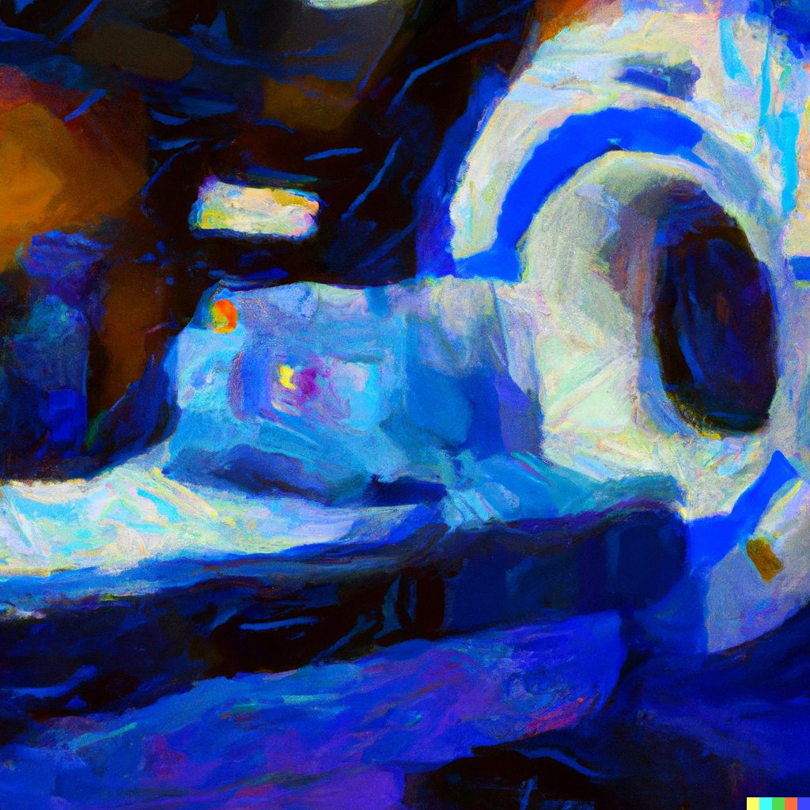

# Experimental Design for Functional Imaging - PSGY4009

Module convenor: <a href="mailto:denis.schluppeck@nottingham.ac.uk?subject=EDFFI-handbook">denis.schluppeck@nottingham.ac.uk</a>

The following is a quick overview of the kind of material you will learn about. Note that some lectures may not take the full 2-hour slot.

## Schedule

Please check for time / location via the [University of Nottingham timetable](https://timetabling.nottingham.ac.uk/2223/)

*as of 2022-09-28* - some of the lectures may change in order.

| UoN week | date            |              | Lecture                                               |
| -------- | --------------- | ------------ | ----------------------------------------------------- |
| Week 03  | Mon 03 Oct 2022 | D Schluppeck | Overview, **fMRI & study design.**                    |
| Week 04  | Mon 10 Oct 2022 | M Schürmann  | **Basic neuroanatomy**                                |
| Week 05  | Mon 17 Oct 2022 | K Dyke       | **Brain stimulation & study design.**                 |
| ~~Week 06~~  | ~~Mon 24 Oct 2022~~ | ~~W v Heuven~~   | ~~**Language**~~                                          |
| Week 07  | Mon 31 Oct 2022 | D Schluppeck | **Vision + brain imaging**                            |
| Week 08  | Mon 07 Nov 2022 | D Schluppeck | **Q&A, experimental design, coursework**              |
| Week 09  | Mon 14 Nov 2022 | L Cragg      | **Developmental neuroimaging.**                       | 
| Week 10  | Mon 21 Nov 2022 | J Derrfuss   | **Cognitive control, attention, and working memory.** |
| Week 11+  | Mon 28 Nov 2022, 2-4pm | W v Heuven   | **Language** (re-run)                                          |
| Week 11  | Mon 28 Nov 2022, 4-6pm | R Filik      | **Moral Cognition**                                   |
| Week 12  | Mon 05 Dec 2022 | D Schluppeck | **Perceptual Decision making**, Q&A for assignment             |

## Assessment

Written assignment (max 3000 words) including a 250 word abstract. For details and the ubmission link, please see [the moodle page](https://moodle.nottingham.ac.uk/course/view.php?id=128949)

## Learning outcomes [MSc in general + this module] 

### Knowledge and understanding

- a comprehensive knowledge of cognitive neuroscience methods

- a thorough understanding of optimal experimental design • basic
    principles in areas of the neurosciences **Intellectual skills:**

- critically appraise and summarise information related to brain
    imaging, taking into account the provisional nature of facts and
    principles in cognitive/clinical/computational neuroscience

- be familiar with scientific methods, including the ability to
    collect and integrate information from the literature

- to design experiments, execute experimental investigations or other
    relevant methods for testing a hypothesis

- undertake independent, self-directed research, taking into account
    ethical considerations

- apply knowledge in brain imaging and cognitive/ clinical/
    computational neuroscience to address research problems • acquire,
    interpret and/or critically analyse research data

### Professional/Practical Skills

- design and carry out appropriate experiments or procedures to test a
    hypothesis, including practical skills such as programming for
    stimulus setup and analysis, collect, record and/or analyse data
    from accurate observations and measurements **Transferable (key)
    skills:**

- systematically search for literature, evaluate neuroscientific
    research, and draw justified conclusions from the evidence

- communicate knowledge or arguments (both orally and in writing) to a
    variety of audiences and to evaluate the views of others
