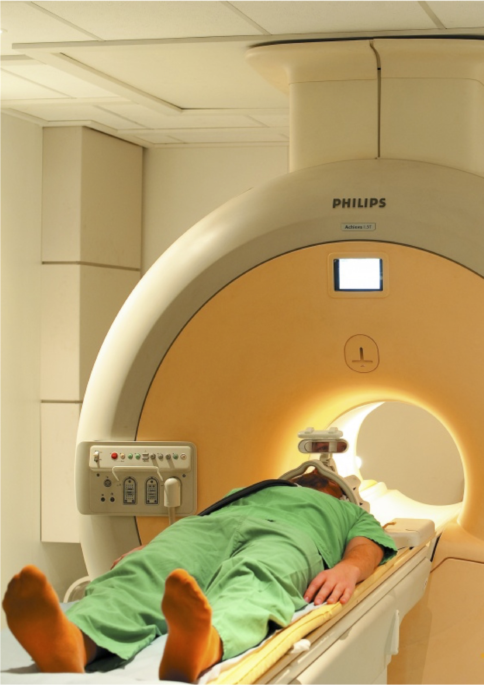

# Experimental Design for Functional Imaging - PSGY4009

- Module convenor: <a href="mailto:denis.schluppeck@nottingham.ac.uk?subject=EDFFI-handbook">denis.schluppeck@nottingham.ac.uk</a>

- Lecture times and locations: please check timetable

The following is a quick overview of the kind of material you will learn about. Note that some lectures may not take the full 2-hour slot.

## Schedule

1.	**Module overview / Basic neuroanatomy** – a primer/refresher. Denis Schluppeck, Martin Schuermann	01/10/19
2.	**fMRI & study design.**	Lauren Marsh
3.	**Brain stimulation & study design.**	Stephen Jackson
4.	**Developmental neuroimaging.**	Lucy Cragg
5.	**Vision: Cognitive neuroscience and experimental design.**	Alan Johnston
6.	**Language: Cognitive neuroscience and experimental design.**	Walter van Heuven
7.	~~Language in context:~~ Cognitive neuroscience and experimental design
Coursework Q&A.	Denis Schluppeck
8.	**Decision making: Cognitive neuroscience and experimental design.**	Denis Schluppeck
9.	**Cognitive control, attention, and working memory.**	Jan Derrfuss
10.	~~Moral cognition~~ **Working with clinical populations [TBD]** /Coursework Q&A.	Denis Schluppeck

## Assessment

Written assignment (max 2500 words) including a 250 word abstract

## Learning outcomes [MSc in general + this module] 

### Knowledge and understanding:

-   a comprehensive knowledge of cognitive neuroscience methods

-   a thorough understanding of optimal experimental design • basic
    principles in areas of the neurosciences **Intellectual skills:**

-   critically appraise and summarise information related to brain
    imaging, taking into account the provisional nature of facts and
    principles in cognitive/clinical/computational neuroscience

-   be familiar with scientific methods, including the ability to
    collect and integrate information from the literature

-   to design experiments, execute experimental investigations or other
    relevant methods for testing a hypothesis

-   undertake independent, self-directed research, taking into account
    ethical considerations

-   apply knowledge in brain imaging and cognitive/ clinical/
    computational neuroscience to address research problems • acquire,
    interpret and/or critically analyse research data
    
### Professional/Practical Skills

-   design and carry out appropriate experiments or procedures to test a
    hypothesis, including practical skills such as programming for
    stimulus setup and analysis, collect, record and/or analyse data
    from accurate observations and measurements **Transferable (key)
    skills:**

-   systematically search for literature, evaluate neuroscientific
    research, and draw justified conclusions from the evidence

-   communicate knowledge or arguments (both orally and in writing) to a
    variety of audiences and to evaluate the views of others
